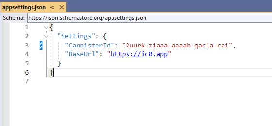
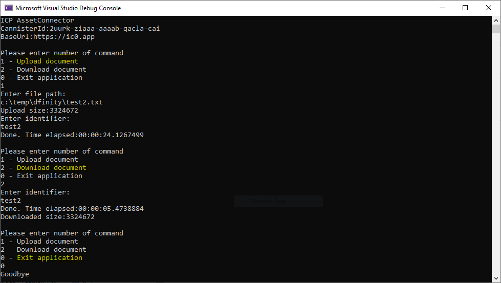

# DocumentStorage console test app
This little c# console app demonstrates how you can access the ICP AssetCanister with c#.

## Usage
Make sure the `asset canister` (found in src/DocumentStorage/asset_canister) is running and the `CanisterId` is set in the `appsettings.json` file.

Also check in the `ICPConnector.cs` class in the method `CreateClient` that you have a valid private key file (*.pem) that corresponds to the Identity the AssetCanister was deployed with. Otherwise upload is prevented.

