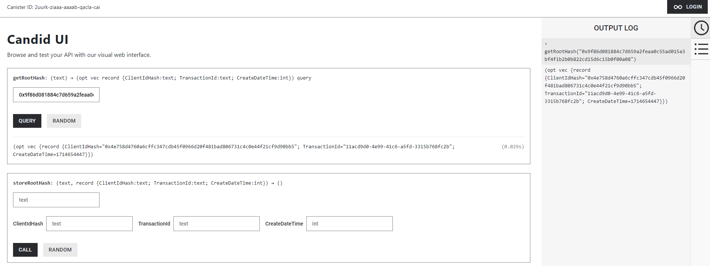

# hashing_canister

This canister stores and retrieves root hashes together with some additional information (CreateDateTime, HashedClientId, TransactionId)

**Deploy Canister**

**Check if Canister is running**
